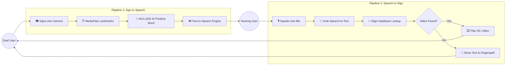

# VAANI: Real-Time ISL ↔ Speech Translator

## The Problem
Real-time communication between Deaf individuals (ISL users) and hearing individuals is difficult. Existing solutions are often slow, expensive, or one-way, creating a frustrating barrier to natural conversation.

## The Solution
VAANI bridges the communication gap. It is a free, bilingual mobile app designed for seamless, two-way translation between Indian Sign Language (ISL) and spoken language in real-time.

## How It Works

VAANI features two distinct pipelines to ensure smooth, two-way communication:

*   📹 **Sign → Speech (For Deaf Users):** Users sign directly into the camera. The app extracts hand and body landmarks, and an AI model translates the signs into text, which is then spoken out loud.
*   🎙️ **Speech → Sign (For Hearing Users):** Users speak into the microphone. The app converts the speech into text and plays the corresponding Indian Sign Language (ISL) video sequence so the Deaf user can understand.
*   🚨 **Emergency Button:** A built-in feature to instantly broadcast a pre-recorded SOS audio message ("This person is deaf and needs help").

## Architecture Flow



## Tech Stack
*   **Frontend:** Vanilla JS/HTML/CSS, Vite, MediaPipe Holistic
*   **Mobile Wrapper:** Capacitor.js
*   **Backend API:** FastAPI (Python)
*   **AI Models:** PyTorch (INCLUDE Model), Vosk (Speech-to-Text)
*   **Text-to-Speech:** gTTS

## Getting Started

### Backend Setup
```bash
cd backend
# Install Python dependencies
pip install -r requirements.txt

# Start the FastAPI server (Host on 0.0.0.0 to allow mobile testing)
uvicorn main:app --host 0.0.0.0 --reload --port 8000
```

### Frontend Setup
```bash
cd frontend
# Install Node dependencies
npm install

# Start the web app locally
npm run dev

# Or build and deploy to Android
npm run build
npx cap sync android
```

> [!IMPORTANT]
> To test the app on a physical mobile device, ensure your phone and computer are on the **same Wi-Fi network**, and that port `8000` is allowed through your Windows Firewall.
